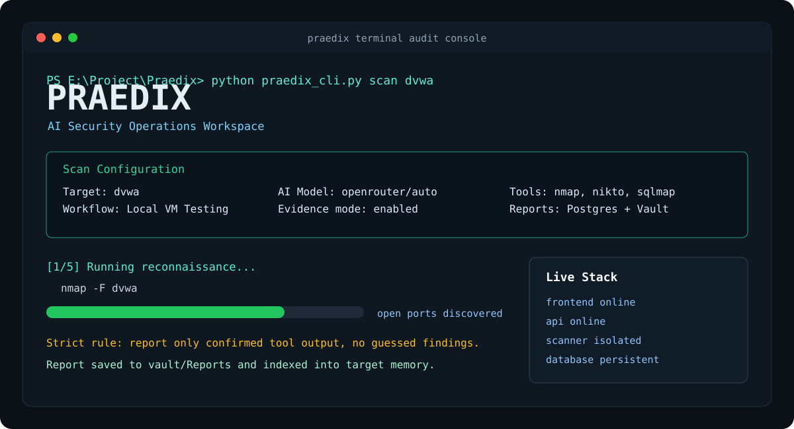

# Praedix

<p align="center">
  
</p>

Praedix is an AI-assisted security operations workspace for authorized reconnaissance, local lab testing, tool-driven web assessments, and evidence-based reporting.

It combines a React dashboard, Flask API, isolated scanner containers, OpenRouter-powered agent orchestration, PostgreSQL scan memory, and an Obsidian-style Markdown vault for reports and knowledge.

> Use Praedix only on systems you own or are explicitly authorized to test.

## Features

- AI-assisted scan planning through OpenRouter-compatible models
- Isolated scanner runtime for security tools
- React dashboard for scans, reports, tools, and knowledge
- Flask API for orchestration and status endpoints
- PostgreSQL persistence for targets, scans, tool runs, findings, reports, and target memory
- Markdown vault for human-readable reports and knowledge-base notes
- Local VM testing workflow for lab targets such as DVWA
- Research workflow with scope approval controls
- Optional OnionClaw/Tor OSINT runner with explicit guardrails
- CLI client for terminal-driven scans

## Architecture

```text
Praedix
├── frontend/        React + Vite dashboard
├── api/             Flask API and AI scan orchestration
├── agents/          Commander and agent runtime scripts
├── tools/           Isolated security tool wrappers
├── vault/           Markdown knowledge base and reports
├── wiki/            Maintained security intelligence notes
├── data/            Local runtime data, ignored by git
├── infra/nginx/     Gateway configuration
└── docker-compose.yml
```

Core runtime services:

- `frontend`: dashboard UI
- `api`: Flask API and scan coordinator
- `scan-runner`: isolated scanner container
- `onionclaw-runner`: gated OSINT/Tor research container
- `db`: PostgreSQL
- `queue`: Redis
- `nginx`: gateway
- `dvwa`: optional local vulnerable lab target

## Tooling

The scanner wrapper currently allows a constrained set of tools:

- `nmap`
- `sqlmap`
- `nikto`
- `dirb`
- `whois`
- `dig`
- `wafw00f`
- `traceroute`
- `sslscan`
- `curl`

The AI agent can choose from allowed tools only. Tool output is stored and used as evidence for reports.

## Requirements

- Docker Desktop
- Docker Compose
- Node.js 18+ if running the frontend outside Docker
- Python 3.11+ if running API/CLI outside Docker
- OpenRouter API key

## Quick Start

1. Clone the repository:

```powershell
git clone https://github.com/YOUR_USERNAME/praedix.git
cd praedix
```

2. Create your local environment file:

```powershell
copy env.example .env
notepad .env
```

3. Fill in at least:

```env
OPENROUTER_API_KEY=your-openrouter-api-key-here
POSTGRES_PASSWORD=change-this-password
JWT_SECRET=change-this-secret-min-32-chars
```

4. Start the stack:

```powershell
docker compose up --build
```

5. Open the dashboard:

```text
http://localhost:3000
```

Useful local targets:

```text
http://localhost:8888    # DVWA lab target
dvwa                     # internal Docker target alias
```

## CLI Usage

Praedix also includes a terminal client that talks to the API.

```powershell
python praedix_cli.py status
python praedix_cli.py scan dvwa
```

The API must be running before using the CLI.

## Configuration

Copy `env.example` to `.env` and update local values.

Important variables:

| Variable | Purpose |
| --- | --- |
| `OPENROUTER_API_KEY` | OpenRouter API key for AI orchestration |
| `AI_MODEL` | Model id, defaults to `openrouter/auto` |
| `POSTGRES_USER` | PostgreSQL username |
| `POSTGRES_PASSWORD` | PostgreSQL password |
| `POSTGRES_DB` | PostgreSQL database name |
| `REDIS_URL` | Redis connection URL |
| `NEXT_PUBLIC_APP_URL` | App URL used by the frontend/app metadata |
| `JWT_SECRET` | Application secret; use a long random value |

Never commit `.env`.

## Workflows

### Local VM Testing

Use this mode for systems you own, local labs, CTF boxes, DVWA, internal VMs, and pre-deploy checks.

Typical phases:

1. Fast reconnaissance
2. Port and service validation
3. Web checks
4. Targeted tool execution
5. Evidence-driven report

### Vulnerability Research

Use this mode for research and exposure analysis. Sensitive OSINT features require explicit scope approval.

Research scope can include:

- client/project name
- allowed keywords
- blocked keywords
- dark web / OSINT toggle
- onion fetch approval
- identity rotation approval
- approver name

## Reports and Memory

Praedix stores results in two layers:

- PostgreSQL: structured scan state, tool runs, findings, reports, and target memory
- Markdown vault: human-readable reports and knowledge-base notes

Generated local reports are ignored by git by default.

## Development

Backend syntax check:

```powershell
python -m py_compile api\app.py api\db.py tools\hackingtool_wrapper.py tools\onionclaw_wrapper.py agents\commander.py agents\debug_api.py
```

Frontend build:

```powershell
cd frontend
npm install
npm run build
```

Docker config validation:

```powershell
docker compose config
```

## Security Notes

- Do not commit `.env`, local databases, reports, certificates, or API keys.
- Rotate any API key that has ever been pasted into logs, screenshots, or shared messages.
- Keep scanner tools inside the provided isolated runtime.
- Do not add phishing, DDoS, RAT, credential theft, persistence, or post-exploitation tooling.
- Always verify AI-generated findings against raw tool output.

## Roadmap

- Add stronger DAST/recon tooling: `nuclei`, `katana`, `ffuf` or `feroxbuster`, `httpx`, `subfinder`, `arjun`, `dalfox`, `whatweb`, and `testssl.sh`
- Add richer finding deduplication and confidence scoring
- Add better report templates
- Add RAG-style retrieval for the knowledge base
- Add GitHub Actions checks for frontend build and backend syntax validation

## Disclaimer

Praedix is for defensive security, authorized testing, research, and education. You are responsible for ensuring that every scan has explicit permission and complies with applicable laws and rules of engagement.
